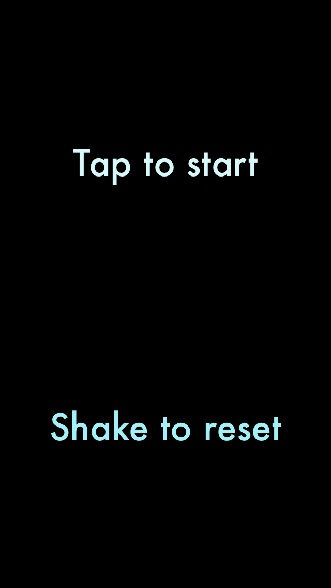
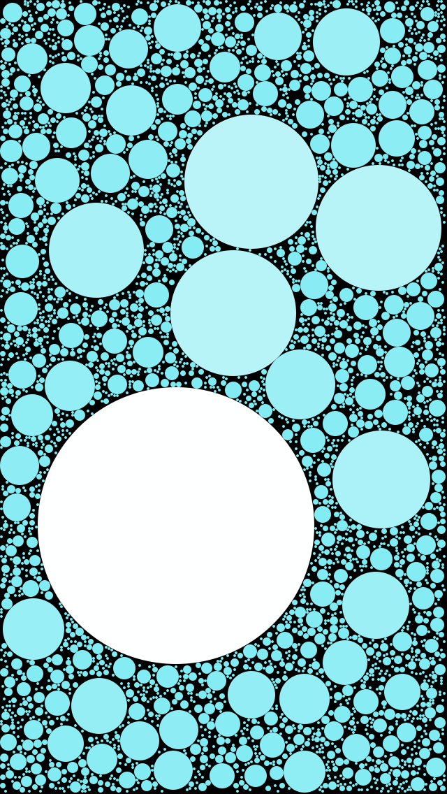
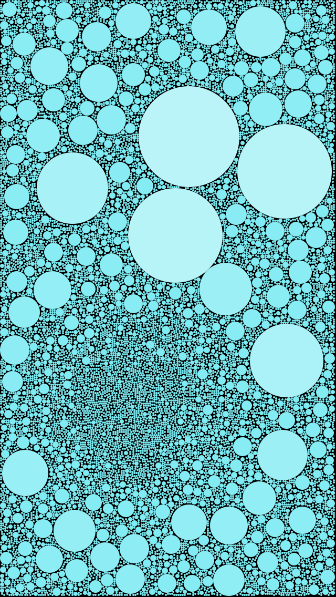

# Circlone

An iOS app generating random abstract images from circles





---

## To launch
1. Checkout repository 

```
git clone --recursive git@github.com:vytis/Circlone.git
```
2. Open `Circlone.xcodeproj`
3. Build `Circlone` target

### Requirements
Xcode 7.3


